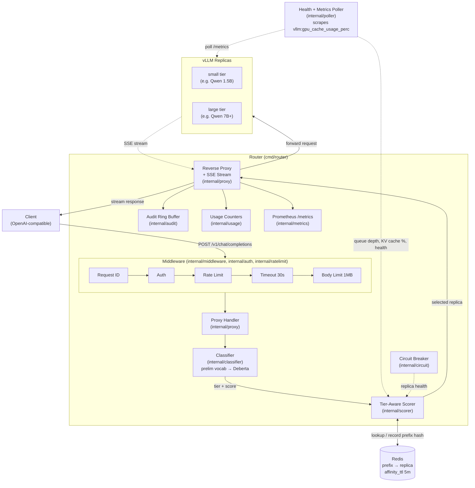
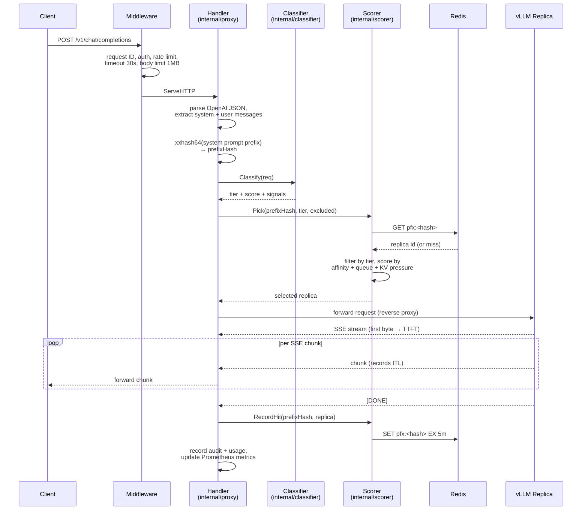

# Architecture

How a request flows from a client, through the router, to a vLLM replica.

The diagrams below render natively on GitHub. Each one names the Go subsystem that owns the work so you can jump from picture to package without grepping.

## System Architecture

The Scorer reads two live signals on every pick: the affinity entry from Redis (which replica recently served this prefix) and the queue depth + KV cache utilization from the Poller. The Circuit Breaker excludes replicas that have crossed the error threshold. After the response streams back, the SSE interceptor records TTFT, ITL, and TPS into the Prometheus metrics on the way out.

For the scoring weights and tier-filter behavior, see [README §Scoring Formula](../README.md#scoring-formula). For the classifier signals, see [README §Classification Signals](../README.md#classification-signals).

## Request Lifecycle

The hot path above assumes a healthy replica. When the chosen replica fails to produce a first byte within `stream.stall_timeout`, the handler retries against a different replica — that branch is in `internal/proxy/handler.go` (the retry loop and `peekFirstByte` dead-replica detection) and is left out of this diagram for clarity.
